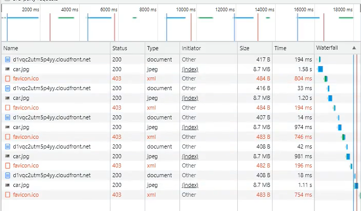
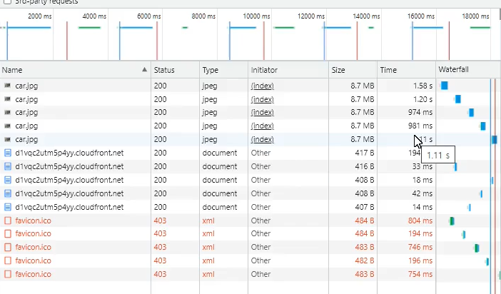

### **01-4 CloudFront를 사용한 웹 사이트 성능 가속화**

1. CloudFront 에서 배포 생성 클릭
2. **[원본]**
    - 도메인 : 이전 강의에서 생성된 s3 도메인 선택
    - 나머지 default로 두기
3. **[기본 캐시 동작]**
    - default로 두기
4. **[설정]**
    - 기본값 루트 객체 - mycar.html
    - 나머지 defautlt
5. 배포 생성하기 ( 5 분뒤에 상태가 활성화되면서 상태 **활성화됨**)
6. 생성된 CloudFront의 배포 도메인 이름 복붙 (S3와 동일한 페이지가 보여야 함)
7. S3와 CloudFront 둘중 어떤게 새로고침을 했을때 페이지 로드가 더 빠를까?
    - S3와 CloudFront 둘다 새로고침 연속5번씩 클릭
    - car 이미지 로드 속도가 **CLF**가 S3보다 **더 빨랐음** 그 이유는 ?
    ```
    Ans) S3는 새로고침 할때마다  S3버킷에서 Object를 불러와 페이지를 로드함.
         but CLF는 S3의 버킷 Object를 캐싱하여 캐싱서버에 저장하기 때문에 
         request(새로고침) 이/가 있을때 캐싱서버에 저장되었는 정보를 불러오기
         때문에 더 CLF방식이 더 빠르다.
    ```

### **[IMG]**

---

**[CloudFront 로 웹 호스팅 img]**



<br>

**[S3로 웹 호스팅 img]**




### **Description**
이 강의를 보면서 완벽하게 이해하진 못 했지만 그래도 어느정도 CloudFront에 대해서 알게된 것 같다.<br>

내가 생각하는 CloudFront의 가장 큰 장점은 바로 캐싱이라고 생각하는데 그 이유는 캐싱으로<br> 
접근 속도를 최적화하기 때문에 잘 못 기다리는 나에게 캐싱의 장점이 좀 크게 와닿은 것 같다!
